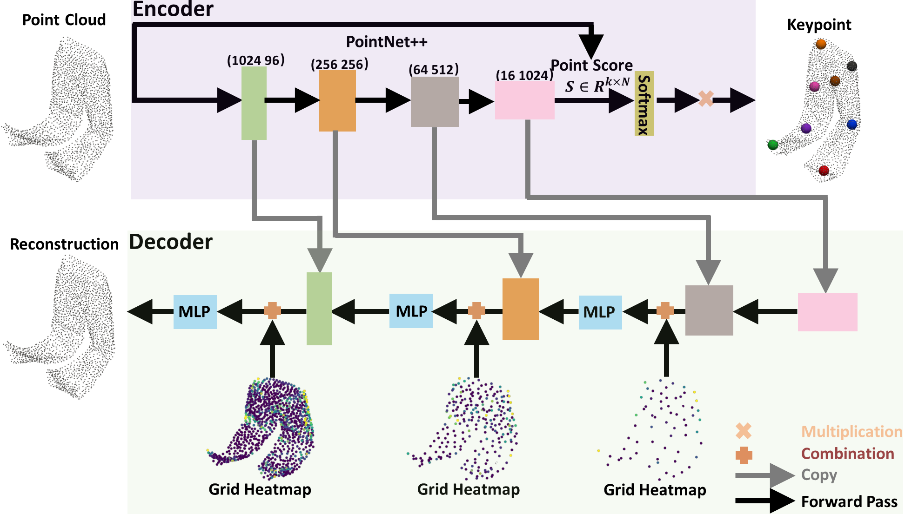

# <a href="https://jackhck.github.io/keygrid.github.io/"> [NeurIPS 2024] Key-Grid: Unsupervised 3D Keypoints Detection using Grid Heatmap Features</a>
 

This repository provides the  code for paper:  
**Key-Grid: Unsupervised 3D Keypoints Detection using Grid Heatmap Features**

     
  

# 💻 Installation

* [ClothesNet dataset](https://sites.google.com/view/clothesnet/home)
* PyTorch ≥ 1.4
* Scikit-learn
* Open3d
* Pyvista
* Pytorch3d

# 🛠️ Usage

### Train the network
**Train the pointnet++ on the train dataset.** Here, we take the chair category as an example. Note, if you want to train other categories, you should change the dataset root.
<pre>
python train.py 
</pre>
### Predict the keypoint
**Predict the keypoint on the test dataset.** We get the keypoint predicted by the pointnet++ on the ClothesNet dataset.
<pre>
python predict_keypoint.py  
</pre>

# 🔍 Visualizer
In this section, we provide code to visualize keypoints and point cloud. **1.Predict the keypoints on the test dataset.** 
You should run  `predict_keypoint.py`; **2. Visualization results of keypoints and point cloud.** You should run  `vision.py`.

# 😺 Acknowledgement
This code inherits some codes from [Skeleton Merger](https://github.com/eliphatfs/SkeletonMerger), [SC3K](https://github.com/IIT-PAVIS/SC3K).
